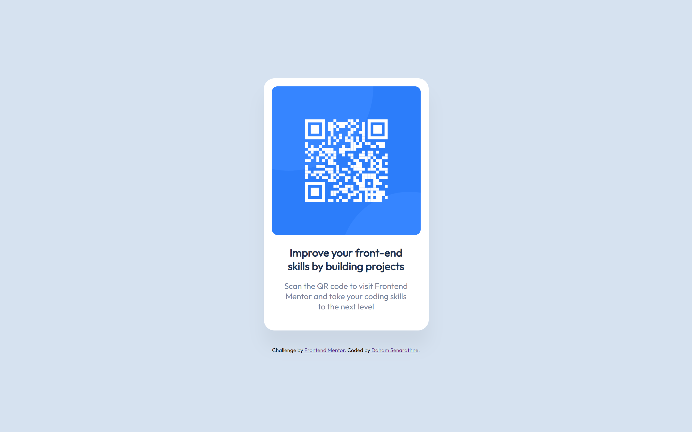
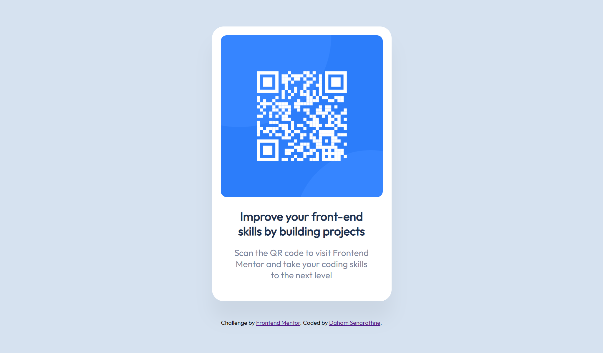

# Frontend Mentor - QR code component solution

This is a solution to the [QR code component challenge on Frontend Mentor](https://www.frontendmentor.io/challenges/qr-code-component-iux_sIO_H). Frontend Mentor challenges help you improve your coding skills by building realistic projects.

## Table of contents

- [Screenshot](#screenshot)
- [Links](#links)
- [Built with](#built-with)
- [What I learned](#what-i-learned)
- [Author](#author)

**Note: Delete this note and update the table of contents based on what sections you keep.**

### Screenshot

### Links

- Solution URL: [Add solution URL here](https://your-solution-url.com)

### Built with

-pure HTML, CSS.

### What I learned

Frontend Mentor challenges are an excellent source of learning, and through this project, I have gained knowledge about various aspects such as minimal and simple design. Despite its small scale, this project has provided me with valuable insights. I look forward to taking on more challenges and further enhancing my experience in frontend design.

## Author

- Frontend Mentor - [@Daham-Senarathne](https://www.frontendmentor.io/profile/Daham-Senarathne)
